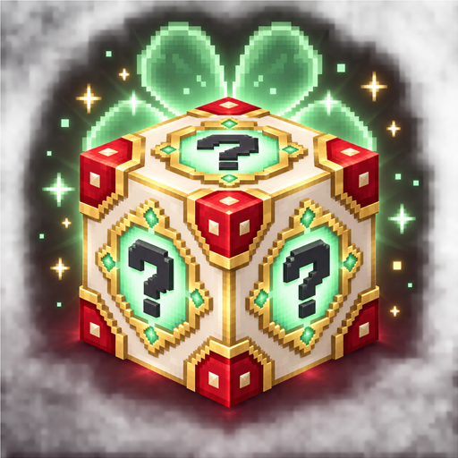
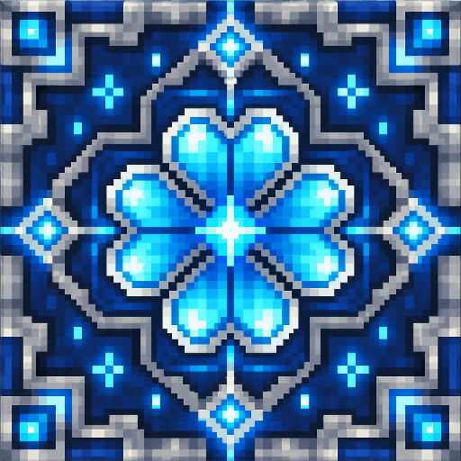
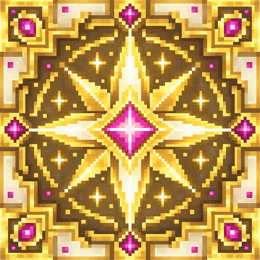
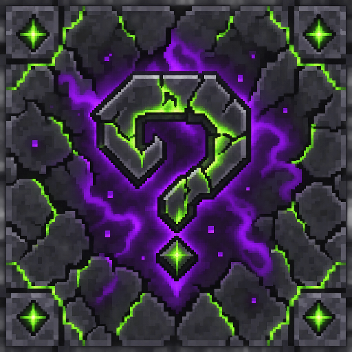
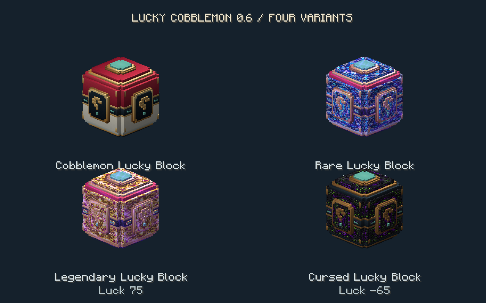

<p align="center">
  
</p>

<h1 align="center">Lucky Cobblemon: Fortune Blocks</h1>

<p align="center"><strong>Quebre o bloco. Teste a sua sorte. Encontre a próxima surpresa.</strong></p>

<p align="center">
  
  
  
  
  
</p>

---

**Lucky Cobblemon: Fortune Blocks** é um mod para Fabric que leva blocos da sorte ao universo do Cobblemon. Cada bloco guarda um valor próprio entre **−100 e +100** e, quando quebrado, escolhe um evento temático: encontros de Pokémon, itens, trios, santuários, Raid Dens, efeitos de azar ou um jackpot lendário shiny.

> [!IMPORTANT]
> Este é um projeto independente e não oficial. **Cobblemon** e **Fabric API** são dependências obrigatórias. O mod deve ser instalado no servidor e nos clientes.

## Visão geral

| | |
| --- | --- |
| 🎲 **Sorte por bloco** | Cada bloco preserva seu próprio valor, inclusive depois de ser colocado. |
| 🌍 **Geração natural** | Novos chunks do mundo normal podem gerar Lucky Blocks na superfície. |
| ✨ **26 eventos e variações** | Pokémon, shinies, suprimentos, grupos, santuários, azares e jackpots. |
| 🧱 **Quatro variantes** | Comum, Rara, Lendária e Amaldiçoada, cada uma com sorte-base própria. |
| 🛠️ **Configurável** | Pesos, níveis e listas de espécies ficam em um JSON simples. |
| 🧭 **Servidor e single-player** | A lógica dos eventos roda no servidor e funciona em mundos locais. |
| 🏛️ **Integração opcional** | Com Raid Dens instalado, um resultado pode criar um Raid Den real. |
| 🌐 **Dois idiomas** | Todas as mensagens e dicas estão disponíveis em português brasileiro e inglês. |

## Compatibilidade

| Componente | Versão | Obrigatório |
| --- | --- | :---: |
| Minecraft: Java Edition | `1.21.1` | Sim |
| Fabric Loader | `0.17.2` ou superior | Sim |
| Fabric API | `0.116.6+1.21.1` ou superior | Sim |
| Cobblemon | `1.7.3` ou superior | Sim |
| Java | `21` ou superior | Sim |
| Cobblemon Raid Dens | `0.11.7` ou superior | Não |

## Instalação

1. Instale o **Fabric Loader** para Minecraft `1.21.1`.
2. Coloque **Fabric API**, **Cobblemon** e `lucky-cobblemon-0.6.0.jar` na pasta `mods`.
3. Se quiser Raid Dens reais como resultado, adicione também **Cobblemon Raid Dens**.
4. Inicie o jogo. O arquivo `config/luckycobblemon.json` será criado automaticamente.

Em multiplayer, use as mesmas versões do mod e das dependências no servidor e em todos os clientes.

## Receita do bloco

Na bancada, combine quatro barras de ouro, quatro Poké Bolas e um ejetor:

```text
O P O
P E P
O P O

O = Barra de ouro
P = Poké Bola
E = Ejetor
```

## Variantes

<p align="center">
  
  
  
</p>

<p align="center">
  
</p>

| Variante | Sorte-base | Progressão |
| --- | ---: | --- |
| Bloco da Sorte Cobblemon | 0 | Receita original com ouro, Poké Bolas e ejetor |
| Bloco da Sorte Raro | +35 | Bloco comum, quatro diamantes e quatro fragmentos de ametista |
| Bloco da Sorte Lendário | +75 | Bloco raro, quatro blocos de ouro, três varas de blaze e uma Estrela do Nether |
| Bloco da Sorte Amaldiçoado | −65 | Bloco comum, quatro areias das almas e quatro olhos de aranha fermentados |

Todas as variantes aceitam os modificadores da bancada e preservam o próprio tipo ao ajustar a sorte.

## Sistema de sorte

Combine um Lucky Block com um ou mais modificadores em qualquer posição da grade. O resultado é limitado a `−100` e `+100`. Blocos positivos recebem brilho e o valor aparece na descrição do item.

| Modificador | Sorte | Modificador | Sorte |
| --- | ---: | --- | ---: |
| Barra de ferro | +3 | Carne podre | −5 |
| Bloco de ferro | +30 | Olho de aranha | −10 |
| Barra de ouro | +6 | Olho de aranha fermentado | −20 |
| Bloco de ouro | +60 | Batata venenosa | −10 |
| Esmeralda | +8 | Baiacu | −20 |
| Bloco de esmeralda | +80 |  |  |
| Diamante | +12 |  |  |
| Bloco de diamante | +100 |  |  |
| Maçã dourada | +40 |  |  |
| Maçã dourada encantada | +100 |  |  |
| Estrela do Nether | +100 |  |  |

A sorte positiva reduz resultados comuns e aumenta as chances relativas de raros, épicos, Raid Dens, míticos e lendários. A sorte negativa aumenta o peso dos eventos de azar.

## Possíveis resultados

- Pokémon comuns, incomuns, raros, épicos, míticos e lendários;
- chance de shiny em resultados especiais;
- pacotes de Poké Bolas e Doces Raros;
- colheita de apricorns, piquenique de berries e pedras evolutivas;
- kits de cura, tesouros minerais e fragmentos fósseis;
- trios épicos, revoadas comuns, duplas raras e desfiles de iniciais;
- Santuário da Sorte, Altar de Cristal e Jardim de Cura;
- Raid Den real quando o mod opcional está disponível;
- efeitos de azar não letais, como neblina, teias, fome, trovões, ouro falso ou batatas venenosas;
- jackpot lendário shiny acompanhado de uma Master Ball.

Sem Cobblemon Raid Dens, o evento correspondente vira diretamente um encontro raro. Nenhum comando inexistente é executado e nenhum aviso de erro é gerado. Se a criação de um Pokémon ou Raid Den falhar por outro motivo, o mod entrega uma recompensa alternativa.

## Geração natural

O Lucky Block pode aparecer na superfície do mundo normal. Há, em média, **uma tentativa a cada 48 chunks**; isso não garante um bloco em cada intervalo. Somente chunks gerados depois da instalação recebem essa geração.

Cada bloco natural nasce com sorte independente:

- valores de `−90` a `+90`, em passos de 5, favorecendo valores próximos de zero;
- `2,5%` de chance de receber `+100`;
- `2,5%` de chance de receber `−100`.

## Configuração

Depois da primeira inicialização, edite `config/luckycobblemon.json`. É possível ajustar os pesos dos eventos, níveis mínimos e máximos, listas de espécies e `allowCreativeActivation`.

Por padrão, quebrar o bloco no modo Criativo não ativa eventos. Defina `allowCreativeActivation` como `true` apenas se quiser permitir esse comportamento.

Se o arquivo ficar inválido, o mod salva uma cópia com o sufixo `.invalid-<timestamp>` e restaura os valores padrão.

> [!TIP]
> Depois de editar o arquivo, use `/luckycobblemon reload` ou reinicie o jogo/servidor. Uma recarga inválida é rejeitada e a configuração anterior continua ativa.

## Comandos

| Comando | Permissão | Função |
| --- | --- | --- |
| `/luckycobblemon chances` | Todos | Mostra as chances exatas do Lucky Block segurado na mão principal. |
| `/luckycobblemon reload` | Operador nível 2 | Valida espécies, pesos e níveis antes de aplicar novamente a configuração. |

## Para desenvolvedores

Requisito: **JDK 21**. O projeto inclui o Gradle Wrapper, então não é necessário instalar Gradle globalmente.

```bash
./gradlew build
```

No Windows:

```powershell
.\gradlew.bat build
```

O JAR de distribuição será criado em `build/libs/lucky-cobblemon-0.6.0.jar`. O arquivo com `-sources` contém apenas o código-fonte e não deve ser instalado nem enviado como arquivo principal ao CurseForge.

Para abrir um cliente de desenvolvimento completo, informe o JAR local do Cobblemon:

```powershell
.\gradlew.bat runClient -Pcobblemon_runtime_jar="C:\caminho\Cobblemon-fabric-1.7.3+1.21.1.jar"
```

## Lançamentos

- [Histórico de alterações](CHANGELOG.md)
- [Material do CurseForge](docs/CURSEFORGE.md)
- [Código-fonte e problemas](https://github.com/Pexe171/LuckyCobblemon)

## Licença e créditos

Distribuído sob a licença [MIT](LICENSE). Criado por **Pexe171**.

Lucky Cobblemon é um add-on comunitário independente. Minecraft e Pokémon são marcas de seus respectivos proprietários. Cobblemon e Cobblemon Raid Dens pertencem aos seus respectivos autores; este projeto não é afiliado nem endossado por eles.
